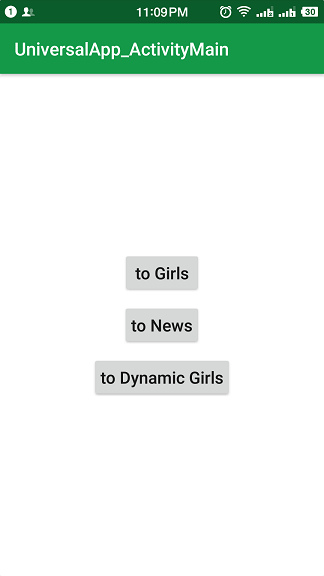

# GoogleArchitectureDemo
谷歌最新MVVM架构，基于dataBinding、lifecycle、retrofit2、rxjava2、okhttp、fresco。

>[简书博客地址:http://www.jianshu.com/p/c0988e7f31fd](http://www.jianshu.com/p/c0988e7f31fd)

## 两个定制app的首页UI图:
|app_universal                                |              app_specific              |
|    ----                                |                 -----                |
|`Activity`组建为主,点击会跳转到不同组建库的`Activity`|     通过`ARoyter`获取不同组建库的`Fragment`来展示       |
   |   |

# 一、MVVM架构优势
[《两张图看懂Android开发中MVC与MVP的区别》](http://blog.csdn.net/u010072711/article/details/77132403) 前面两张图真是了MVC和MVP的区别，我这里也来一张图看看MVVM:


看上图`Model`和`View`是不会发生关系的，`ViewModel`是把View和Model关联起来的加工厂：


## MVVM优势总结：
1. `View`和`Model`双向绑定，一方的改变都会影响另一方，开发者不用再去手动修改UI的数据。额，互相自动的。

2. 不需要`findViewById`也不需要`butterknife`，不需要拿到具体的`View`去设置数据绑定监听器等等，这些都可以用`DataBinding`完成。是不是很舒服?

3. `View`和`Model`的双向绑定是支持生命周期检测的，不会担心页面销毁了还有回调发生，这个由`lifeCycle`完成。

4. 不会像`MVC`一样导致`Activity`中代码量巨大，也不会像`MVP`一样出现大量的`View`和`Presenter`接口。项目结构更加低耦合。

5. 更低的耦合把各个模块分开开发，分开测试，可以分给不同的开发人员来完成。

# 二、MVVM组件化示例项目架构分析

下图是项目模块和工程之间的依赖关系：


下图是工程Android Studio中的目录结构：


## 3.1 各模块和彼此之间的关系解释：

- `lib_opensource` ：第三方build.gradle依赖，本项目主要有`support`、` lifecycle`、`room`、`fresco `、`retrofit`、`okhttp`、`RxJava`、`ARouter`这些。

- `lib_coremodel`: 存放MVVM中的`Model`和`ViewModel`两个模块，就是数据的处理和数据与UI页面的绑定。依赖`lib_opensource`库。

- `lib_common` : 公共库，主要有各种`base`，各种ui组件，自定义组件，公用的`Activity`、公用的`Fragment`，和公用的`utils`等等。依赖`lib_coremodel`库。

- `module_girls` : 妹子功能模块，可以在`library`和`application`之间切换，自己可以是一个`app`也可以成为别的`app的`一个组件模块。组件化编译时为app，反之为module。

- `module_news` : 新闻功能模块，可以在`library`和`application`之间切换，自己可以是一个`app`也可以成为别的`app`的一个组件模块。组件化编译时为app，反之为module。

- `app_universal` : 定制版本的app，组件化编译时 `module_girls`和`module_news`为app，所以不能把这两个作为module加进来编译，所以组件化编译时`app_universal`要依赖`lib_common`库，反之就可以把 `module_girls`和`module_news`作为module加进来编译。

- `app_specific` : 定制版本的app，组件化编译时 `module_girls`和`module_news`为app，所以不能把这两个作为module加进来编译，所以组件化编译时`app_specific`要依赖`lib_common`库，反之就可以把 `module_girls`和`module_news`作为module加进来编译。

## 3.2 ARouter串联各个模块
使用`ARouter`来跳转`Activity`和获取`Fragment`，记得看之前别人的组件化结构文章，一直都在纠结`Fragment`的获取问题，我想说的是有了`ARouter`来获取`Fragment`不是超级简单么？

### ARouter典型应用
- 从外部URL映射到内部页面，以及参数传递与解析
- 跨模块页面跳转，模块间解耦
- 拦截跳转过程，处理登陆、埋点等逻辑
- 跨模块API调用，通过控制反转来做组件解耦


## 3.3 组件化编译和非组件化编译切换
我们在工程根目录下的`gradle.properties`文件中加入一个`Boolean`类型的变量，通过修改这个变量来识别编译模式：
```xml
# 每次更改“isModule”的值后，需要点击 "Sync Project" 按钮
# isModule是“集成开发模式”和“组件开发模式”的切换开关
isModule=false
```

然后在 `module_girls`和`module_news`中的`build.gradle`文件中支持切换：
```xml
if (isModule.toBoolean()) {
    //组件化编译时为application
    apply plugin: 'com.android.application'
} else {
    //非组件化编译时为library
    apply plugin: 'com.android.library'
}

android {
    compileSdkVersion build_versions.target_sdk
    buildToolsVersion build_versions.build_tools

    defaultConfig {
        minSdkVersion build_versions.min_sdk
        targetSdkVersion build_versions.target_sdk
        versionCode 1
        versionName "1.0"

        testInstrumentationRunner "android.support.test.runner.AndroidJUnitRunner"

        //ARouter
        javaCompileOptions {
            annotationProcessorOptions {
                arguments = [moduleName: project.getName()]
            }
        }
    }

    buildTypes {
        release {
            minifyEnabled false
            proguardFiles getDefaultProguardFile('proguard-android.txt'), 'proguard-rules.pro'
        }
    }
    dataBinding {
        enabled = true
    }
    lintOptions {
        abortOnError false
    }
    sourceSets {
        main {
            if (isModule.toBoolean()) {
                //组件化编译时为app，在对应的AndroidManifest文件中需要写ndroid.intent.action.MAIN入口Activity
                manifest.srcFile 'src/main/module/AndroidManifest.xml'
            } else {
                manifest.srcFile 'src/main/AndroidManifest.xml'
                //集成开发模式下排除debug文件夹中的所有Java文件
                java {
                    //debug文件夹中放的是Application类，非组件化时不用有此类
                    exclude 'debug/**'
                }
            }
        }
    }
}

dependencies {
    implementation fileTree(dir: 'libs', include: ['*.jar'])
    api project(':lib_coremodel')
    api project(':lib_common')
    implementation 'com.android.support:support-v4:26.1.0'
    annotationProcessor deps.arouter.compiler
}

```

上面看到了组件化和非组件化编译会有不用的`AndroidManifest`文件，组件化时需要`debug`文件夹下面的`application`类，非组件化时排除此文件夹。


- `module`下的`AndroidManifest`文件是组件化app编译时的，写了`MAIN`入口`Activity`
- `dubug`下是组件化app编译时的`Application`类，初始化作为一个`app`运行时需要的资源等等。在非组件化编译在`build.gradle`文件中排除`debug`文件夹的所以东西。
